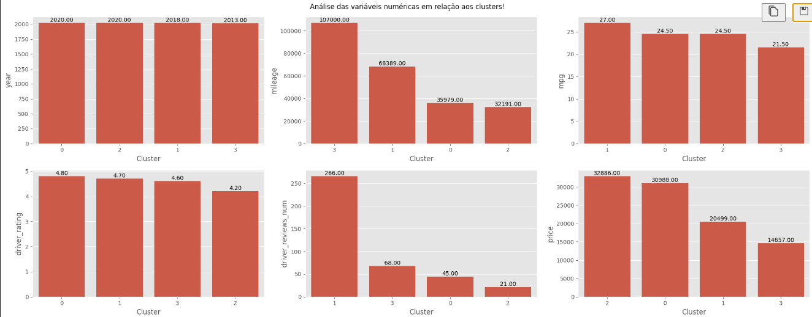
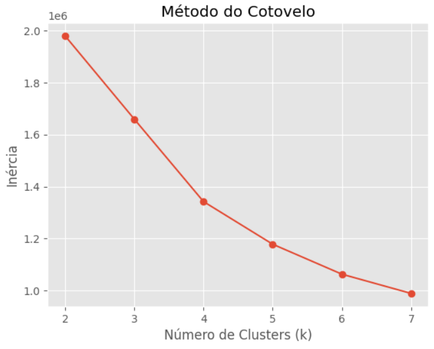

# Projeto de Análise e Precificação de Carros Usados

## Problema

O mercado de carros usados é altamente heterogêneo, com veículos variando em **ano, quilometragem, tipo de combustível, tração, avaliação do motorista** e outros fatores.
Essa variabilidade torna difícil estimar preços precisos, tanto para vendedores quanto para compradores.
O desafio deste projeto é **prever o preço de veículos usados com base em suas características**, identificando padrões e segmentando o mercado para auxiliar na tomada de decisão.

## Objetivo do Projeto

O objetivo deste projeto é desenvolver um **modelo preditivo de precificação de carros usados**, utilizando técnicas de **análise de dados, segmentação e aprendizado de máquina**. A ideia é fornecer previsões consistentes de preços com base nas características dos veículos, auxiliando empresas e consumidores na tomada de decisão e estratégias de compra ou venda.

## Tecnologias Utilizadas

* **Python** – linguagem principal para análise e modelagem.
* **Pandas & NumPy** – manipulação e limpeza de dados.
* **Matplotlib & Seaborn** – visualização de dados e gráficos exploratórios.
* **Scikit-learn** – pré-processamento, regressão, validação cruzada e pipelines.
* **XGBoost & LightGBM** – algoritmos de gradient boosting para regressão.
* **Joblib** – para salvar e carregar pipelines e modelos.
* **Jupyter Notebook** – ambiente de desenvolvimento e documentação do fluxo de trabalho.

## Etapas do Projeto

### 1. Limpeza e Pré-processamento de Dados

Foi realizada uma **limpeza completa dos dados**, incluindo:

* Tratamento de valores ausentes e inconsistentes.
* Correção de tipos de variáveis (numéricas, binárias e categóricas).
* Transformações necessárias para garantir compatibilidade com algoritmos de aprendizado de máquina.

Essas etapas garantem que os dados estejam **confiáveis e consistentes**, prontos para análise exploratória e modelagem preditiva.

### 2. Análise Exploratória de Dados (EDA)

Na EDA, exploramos estatísticas descritivas e relações entre variáveis, dividindo a análise em:

* **Numéricas:** `year`, `mileage`, `mpg`, `driver_rating`, `driver_reviews_num`, `price`.
* **Binárias:** `accidents_or_damage`, `one_owner`, `personal_use_only`.
* **Categóricas:** `transmission`, `exterior_color`, `fuel_type`, `manufacturer`, `drivetrain`.

Durante essa etapa, identificamos **padrões importantes** e potenciais outliers, o que nos ajudou a entender como cada variável influencia o preço dos veículos.

### 3. Segmentação com Clustering

Aplicamos **K-Means** para criar clusters de veículos com características semelhantes, permitindo:

* **Compreender melhor o mercado** e identificar perfis de carros (premium, populares, custo-benefício, luxo).
* **Relacionar características com faixas de preço**, fornecendo insights para a modelagem preditiva.
* **Auxiliar na engenharia de features**, permitindo incluir informações de cluster como variável explicativa no modelo de regressão.

Analise dos clusters

Análise da inercia para identificar os melhor numero de clusters

**Clusters identificados e interpretados:**

* **Cluster 0 – Carros Premium:** veículos recentes, baixa quilometragem, alta avaliação e preços elevados.
* **Cluster 1 – Carros Custo-Benefício:** carros recentes, bom desempenho, muitas avaliações e preços competitivos.
* **Cluster 2 – Carros Luxo/Valorizados:** veículos muito recentes, baixa quilometragem, poucas reviews, mas preços mais altos, indicando valorização de mercado.
* **Cluster 3 – Carros Populares/Usados:** carros mais antigos, maior quilometragem, preços mais baixos e maior uso pessoal.

Essa segmentação **não apenas ajuda na compreensão do mercado**, mas também **melhora a modelagem de regressão**, permitindo que o modelo aprenda padrões específicos de cada tipo de veículo, aumentando a acurácia na previsão de preços.

### 4. Modelagem Preditiva de Preço

Treinamos diversos modelos de regressão para prever preços:

* **Árvores de decisão e ensemble:** Decision Tree Regressor, Random Forest Regressor, XGBoost e LGBM.
* **Modelos lineares:** Linear Regression, Lasso e Ridge.
* **Ensemble avançado:** Gradient Boosting Regressor e Stacking Regressor combinando os melhores modelos.

**Otimização de hiperparâmetros** foi realizada usando **RandomizedSearchCV**, com métricas como **RMSE** e **MAE** para garantir o melhor desempenho preditivo.

### 5. Resultados e Interpretação

O modelo final apresentou **bom desempenho preditivo**, com erros aceitáveis para a maioria dos veículos.

* Clusters permitiram entender padrões de preços de acordo com o tipo de carro, influenciando diretamente a modelagem.
* Outliers extremos nos dados de teste foram mantidos sem tratamento, seguindo **boas práticas de ciência de dados**, simulando situações realistas.
* O modelo é robusto e escalável, podendo ser aplicado a diferentes datasets de veículos usados.

### 6. Conclusão

Este projeto integra **limpeza de dados, análise exploratória, clustering e regressão preditiva**, proporcionando uma visão completa do mercado de carros usados.
O uso de **clusters como variável auxiliar** demonstrou ser uma ferramenta poderosa para entender perfis de veículos e melhorar a acurácia da previsão de preços.
O pipeline final é **flexível, reproduzível e pronto para aplicação em cenários reais**, auxiliando na tomada de decisão para empresas e consumidores.

